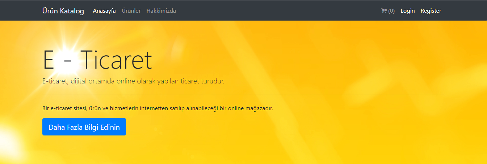
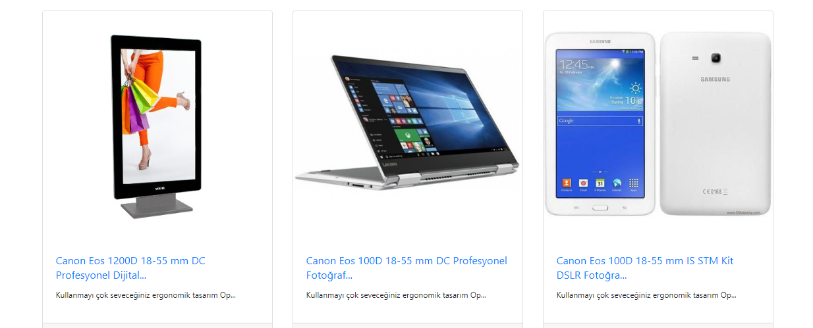
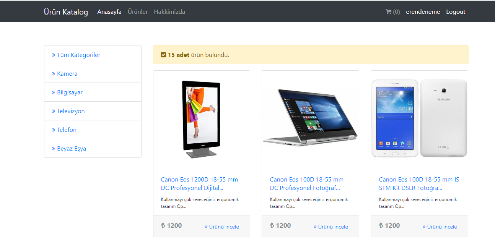

# e-commerce-dotnet
MSSQL veritabanıyla MVC tasarım deseni kullanılarak üyelik login, register, admin panel ve sipariş içeriğiyle e - ticaret uygulaması ORM tool olarak Entity Framework (EF) kullanılmıştır.(E-commerce application with membership login, registration, admin panel, order content using MVC design pattern with MSSQL database. Entity Framework (EF) is used)

